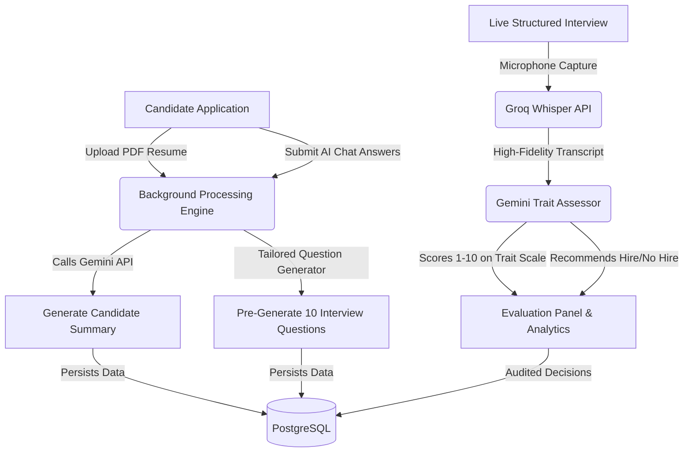

<p align="center">
  
</p>

<h1 align="center">HIRIS</h1>
<p align="center"><strong>Hiring Intelligence & Recruitment Information System</strong></p>

<p align="center">
  
  
  
  
</p>

---

HIRIS is a secure, full-stack, enterprise-grade hiring platform designed for institutional recruitment and organizational governance. It simplifies the end-to-end recruitment pipeline by providing dedicated portals for **Hiring Managers**, **Faculty members**, and the **CHRO** to manage headcount requests, design job descriptions, screen candidates, conduct interviews, and evaluate alignment with organizational policies.

> **Developed by Smriti Kinra & Sartajdeep Singh**

---

## 🛠️ Technology Stack

| Layer | Technologies | Key Capabilities |
| :--- | :--- | :--- |
| **Frontend** | React 18, Vite, React Router, Vanilla CSS | Fast, responsive Single Page Application (SPA) utilizing a custom dark/light dashboard design system. |
| **Backend** | Node.js, Express.js | Highly modular REST API with route controllers, services, and custom permissions middleware. |
| **Database** | PostgreSQL | Relational database schema with fully structured index mappings and relational constraints. |
| **Security** | JWT (`httpOnly` cookies), `bcryptjs`, `helmet`, `express-rate-limit` | Dynamic Role-Based Access Control (RBAC), secure token authentication, encrypted password storage, and brute-force protection. |
| **AI Services** | Google Gemini (3.1 Flash Lite Preview / Fallbacks), Groq Whisper API | High-fidelity speech-to-text transcription (`whisper-large-v3-turbo`) and automatic candidate profile scoring. |
| **Deployment** | Docker, Docker Compose, Nginx | Multi-container setup serving static assets via Nginx and proxying API calls to the Express app. |

---

## 🧠 AI-Powered Recruitment Pipelines

HIRIS leverages advanced generative AI models and transcription workflows at key stages of the recruitment funnel:



### 1. Application Submission $\rightarrow$ Resume Parsing & Summary
*   **Resume Parsing:** Automatically extracts and segments data from uploaded resume/CV PDFs.
*   **Gemini Summarization:** Synthesizes candidate experience and answers from the dynamic application chatbot, computing an **institutional alignment score**.
*   **Tailored Question Generator:** Dynamically creates 10 candidate-specific behavioral questions aligned with institutional policies.

### 2. Audio Interview $\rightarrow$ Speech-to-Text $\rightarrow$ Gemini Evaluation
*   **Whisper Transcription:** Audio recorded directly inside the structured interview room is transcribed in real-time using **Groq's Whisper API (`whisper-large-v3-turbo`)**.
*   **Trait Assessment:** Gemini analyzes the transcription text against the candidate profile and generates trait-level scores (1-10) for Communication, Leadership, Emotional Intelligence, and alignment.

---

## 📂 Project Structure

```bash
hiris/
├── apps/
│   ├── backend/        # Node.js + Express API server, migrations, and AI services
│   └── frontend/       # Vite + React SPA containing all portal layouts and styling
├── packages/
│   └── evaluation/     # Evaluation scripts and developer test suites
├── docs/               # Architecture documents and screenshots
├── scripts/            # Local environment startup scripts and database helper files
├── docker-compose.yml  # Multi-container orchestration configurations
└── package.json        # Workspace configuration and project meta
```

---

## ⚡ Prerequisites

*   **Node.js:** v20+
*   **PostgreSQL:** v15+ (if running locally without Docker)
*   **Docker & Docker Compose:** Required for containerized production setup

---

## 🚀 Local Development Setup

To boot up the application locally, you can utilize the workspace package commands or the automated startup script:

### 1. Database Initialization
Ensure you have a PostgreSQL server running locally. Create a database named `hiris_db` with an administrator user named `postgres`:
```sql
CREATE DATABASE hiris_db;
```

### 2. Install Dependencies
Navigate to the root directory and install the workspace dependencies:
```bash
npm install
```

### 3. Environment Variables Configuration
Copy the template `.env.example` in the backend to `.env`:
```bash
cp apps/backend/.env.example apps/backend/.env
```
Open `.env` and fill in your credential configurations, including your `GEMINI_API_KEY` and `GROQ_API_KEY`.

### 4. Database Migrations
Run the initial schema setup and migrations:
```bash
cd apps/backend
node migrate.js
```

### 5. Launch the Development Servers
Return to the project root and start both servers concurrently:
```bash
bash scripts/start_all.sh
```
*   **Frontend UI:** Available at [http://localhost:5176](http://localhost:5176) (or [http://localhost:5173](http://localhost:5173))
*   **Backend Server:** Serving API routes at [http://localhost:3001](http://localhost:3001)

---

## 👤 Seeding & Demo Accounts

The local database will be seeded with mock accounts. You can log in to experience the role-based views (CHRO, Hiring Manager, or Faculty).

> **Master Password for all seeded accounts:** `hiris2026`

| Portal / Role | Seeded Email Credentials | Primary Scope of Responsibilities |
| :--- | :--- | :--- |
| **CHRO / Admin** | `smriti.kinra@hiris.demo` | Policy uploads, workforce analytics, dynamic role configuration, final interview room actions. |
| **Hiring Manager** | `sartajdeep.singh@hiris.demo`| Job Description builder, posted job pipelines, hiring requests, candidate stages tracker. |
| **Faculty Member**| `gracy.tanna@hiris.demo` | Headcount request submission, Job Description reviews, and technical interview room entry. |

---

## 🐳 Production Deployment (Docker Compose)

The application is container-ready and configured for production environments via Docker Compose:

1. Configure the `.env` variables inside `apps/backend/`.
2. Build and start the services in the background:
   ```bash
   docker-compose up -d --build
   ```
3. The application services will be exposed on:
   *   **Frontend Client:** Served via Nginx on port `8080` (or proxy mapped port `80`)
   *   **Backend API:** Available on port `3001`

---

## 🛡️ CI/CD Pipeline

A GitHub Actions workflow is fully configured in `.github/workflows/ci.yml`. On every push or pull request to the `main` branch, the pipeline automatically:
1. Installs backend and frontend dependencies.
2. Compiles a production-ready build of the React frontend.
3. Spawns the Express backend to run an automated smoke test, verifying that the `/api/health` endpoint serves a `200 OK` status.
