# HIRIS — Hiring Intelligence & Recruitment Information System

> **An AI-powered, enterprise-grade hiring platform** built for universities and institutions. HIRIS manages the full faculty and staff recruitment lifecycle — from headcount requests and job posting through AI-evaluated interviews, final hiring decisions, and employee lifecycle archiving.

---

## Table of Contents

- [Landing Page](#1-landing-page)
- [Authentication](#2-authentication)
- [CHRO Portal](#3-chro-portal)
  - [Dashboard](#31-dashboard)
  - [Candidate Pipeline](#32-candidate-pipeline)
  - [Interview Schedule](#33-interview-schedule)
  - [Analytics](#34-analytics)
  - [Institutional Policies](#35-institutional-policies)
  - [Team Management](#36-team-management)
  - [Role Management](#37-role-management-rbac)
  - [Archive](#38-archive)
- [Hiring Manager Portal](#4-hiring-manager-portal)
- [Faculty Portal](#5-faculty-portal)
- [Candidate Application Portal](#6-candidate-application-portal)
- [AI-Powered Pipeline](#7-ai-powered-pipeline)
- [Tech Stack](#8-tech-stack)

---

## 1. Landing Page

A clean, institutional-grade landing page introducing the HIRIS platform.

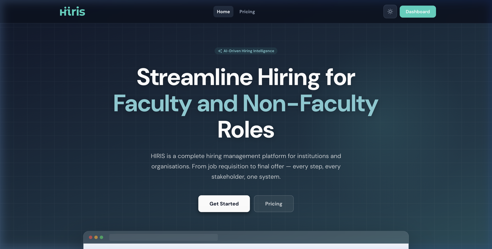

---

## 2. Authentication

Secure login with role-based routing. Each user is automatically directed to their portal (CHRO, Hiring Manager, or Faculty) based on their assigned role and permissions.

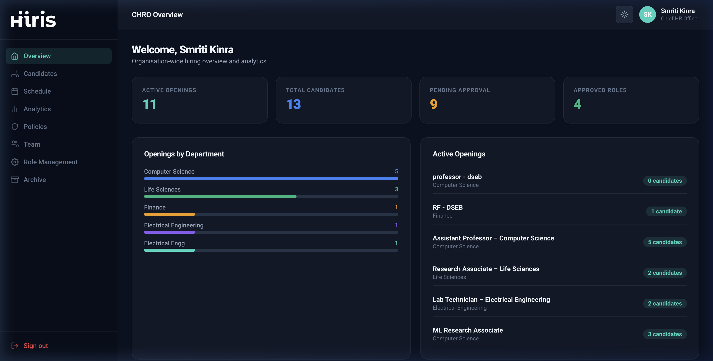

**Credentials for demo:**
| Role | Email | Password |
|------|-------|----------|
| CHRO / Admin | `smriti.kinra@hiris.demo` | `hiris123` |
| Hiring Manager | `arjun@plaksha.edu.in` | `hiris123` |
| Faculty | `gracy.tanna@hiris.demo` | `hiris123` |

---

## 3. CHRO Portal

The CHRO (Chief Human Resources Officer) portal provides full governance over the entire hiring pipeline, institutional policies, workforce analytics, and team management.

### 3.1 Dashboard

Real-time overview of the hiring funnel, candidate stats, recent activity, and pipeline health.

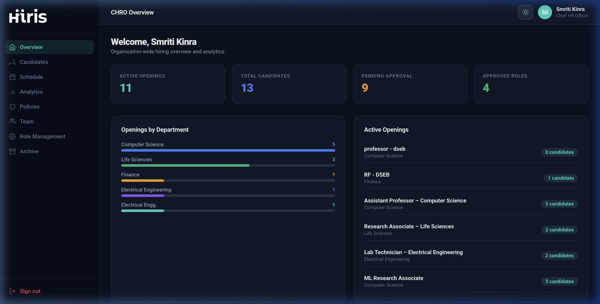

**Highlights:**
- Live hiring funnel visualization across all active roles
- Candidate stage distribution (Applied → Screening → Technical → Behavioral → Offered)
- Recent candidate activity feed
- Active job postings at a glance

---

### 3.2 Candidate Pipeline

A comprehensive, filterable view of all candidates across every active hiring pipeline.

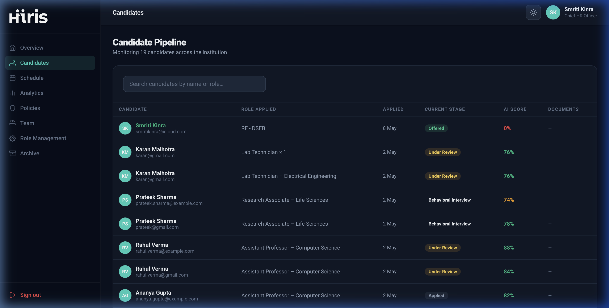

**Highlights:**
- Filter candidates by stage, role, department, and AI score
- AI-generated candidate summaries surfaced directly in the table
- One-click access to full candidate profiles with resume, interview scores, and evaluations
- Move candidates between pipeline stages with full audit trail

---

### 3.3 Interview Schedule

Manage and schedule behavioral and final-round interviews from a unified scheduling view.

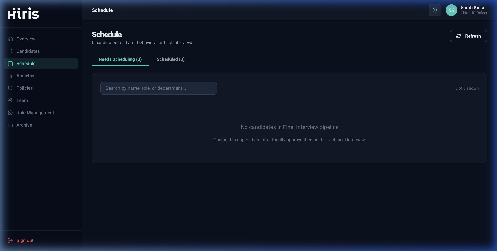

**Highlights:**
- "Needs Scheduling" queue — candidates awaiting interview assignment
- "Scheduled" queue — upcoming interviews with interviewer and time details
- One-click access to behavioral interview room
- Integrated AI-generated behavioral question sets per candidate

---

### 3.4 Analytics

Data-driven hiring insights across departments, roles, pipeline stages, and time periods.

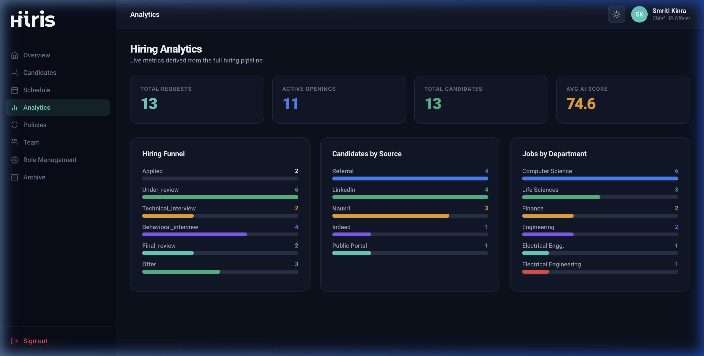

**Highlights:**
- Pipeline conversion funnel (Applied → Hired)
- Hiring source effectiveness (referrals, direct, job boards)
- Department-level hiring velocity
- Time-to-hire and offer acceptance rates
- Rejection analysis by stage

---

### 3.5 Institutional Policies

Upload and manage organizational values documents (PDF) that AI uses for evaluating candidate alignment.

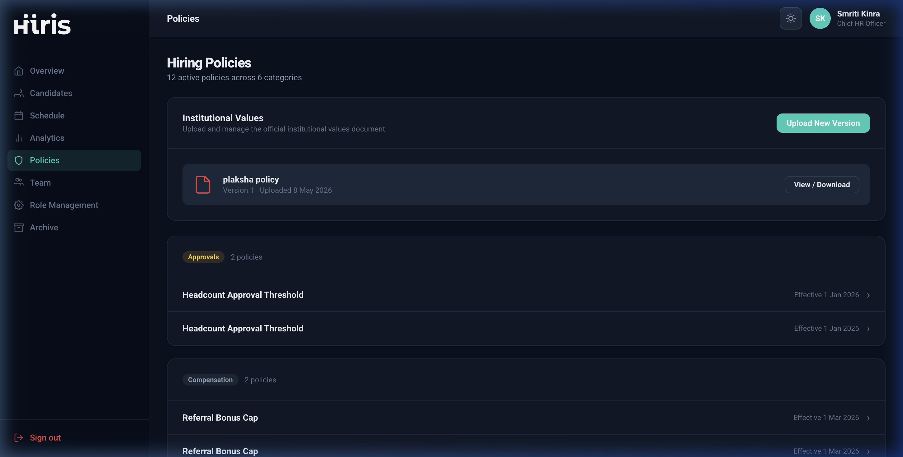

**Highlights:**
- Upload institutional values PDFs (parsed and embedded for AI evaluation)
- Version history — track all policy document iterations
- Policy categories: Hiring Thresholds, Diversity Standards, Behavioural Frameworks
- All AI evaluations are automatically calibrated against the latest uploaded policy

---

### 3.6 Team Management

Manage platform users — view roles, active requests, and team structure.

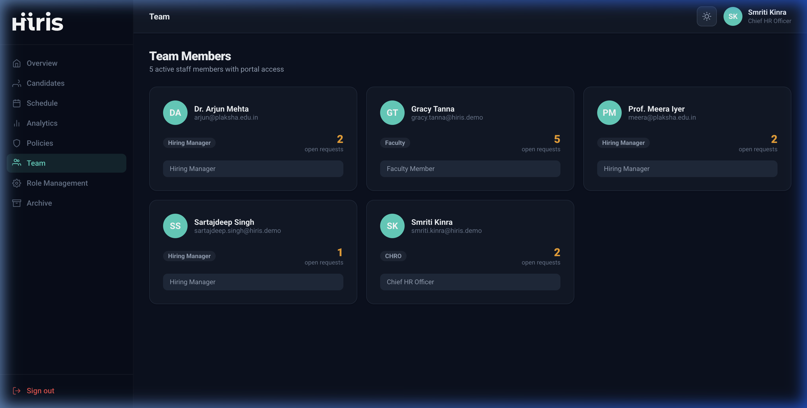

**Highlights:**
- Full roster of all users with their role, department, and active request count
- Invite or manage team members
- Role assignments visible per user

---

### 3.7 Role Management (RBAC)

Fully dynamic Role-Based Access Control. Define custom roles with granular permissions per portal and pipeline stage.

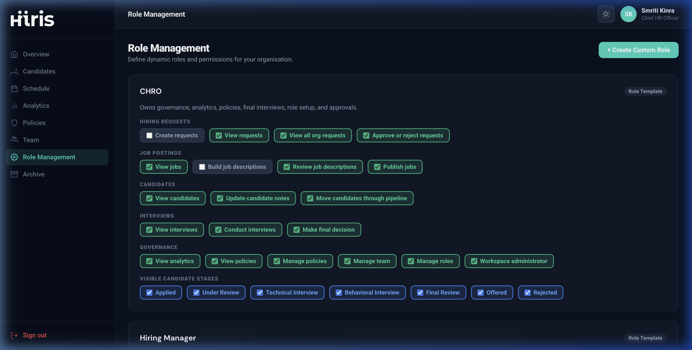

**Highlights:**
- Create custom roles with any combination of permissions
- Control which pipeline stages each role can see (e.g. Hiring Manager sees only `applied` and `under_review`)
- Per-role portal assignment (CHRO portal, Hiring portal, Faculty portal)
- Live permission preview — changes take effect immediately on next login
- System roles (CHRO, Hiring Manager, Faculty) are protected from deletion

---

### 3.8 Archive

Centralized workforce intelligence and historical hiring database.

#### Employees Tab
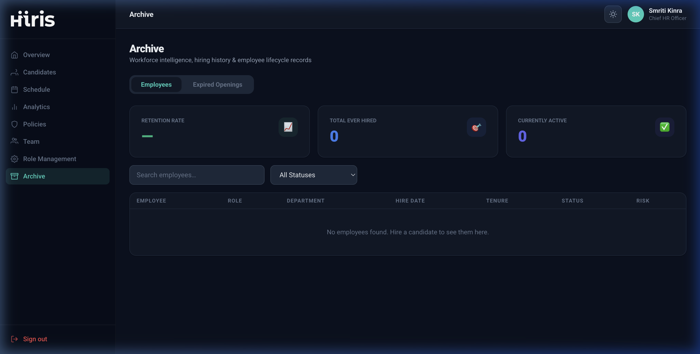

- Full roster of all current and former employees
- Retention rate, attrition tracking, and department stability bars
- Filter by status: Active / Resigned / Terminated / On Leave
- Tenure displayed in months, attrition risk badge (Low / Medium / High / Critical)

#### Expired Openings Tab
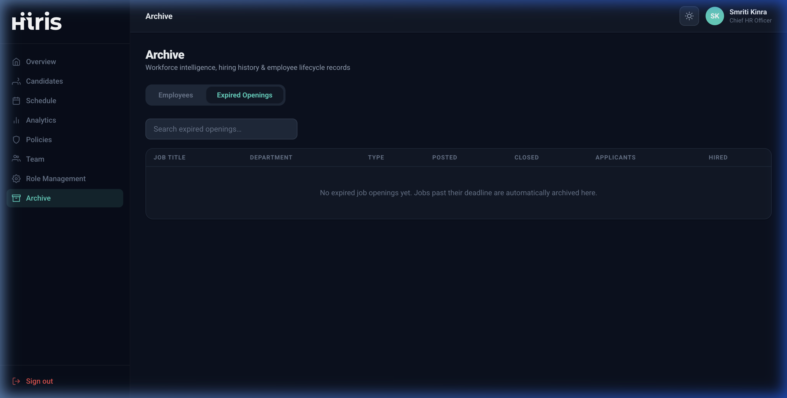

- All job postings past their deadline are automatically archived here
- Applicant counts, hired counts, and rejection counts per expired role
- Click any row to view the full applicant history for that opening
- Searchable and filterable by department and close reason

---

## 4. Hiring Manager Portal

The Hiring Manager (HM) portal manages job requests, JD building, and candidate tracking for specific roles.

**Key Features:**
- **Hiring Requests** — submit headcount requests to the CHRO for approval
- **Job Posting Builder** — rich text JD builder with skills, responsibilities, qualifications, application form designer, and hiring stage configurator
- **Send for Faculty Review** — JDs are routed to Faculty for approval before going live
- **Post Jobs** — once approved by Faculty, HMs click "Post" to make the job live on the public candidate portal
- **Posted Jobs** — manage all live job postings, view applicants, track pipeline stages
- **Candidate Management** — review candidate profiles, add notes, and move candidates through screening stages

---

## 5. Faculty Portal

Faculty members play a dual role: they initiate hiring requests and serve as JD reviewers and interviewers.

**Key Features:**
- **My Requests** — submit headcount requests for new faculty or staff positions
- **JD Reviews** — review and approve (or reject with comments) Job Descriptions prepared by Hiring Managers
- **Interviews** — conduct technical interviews using the structured interview room
- **Interview Room** — distraction-free, notes-focused UI with a built-in microphone that records audio for post-interview Whisper transcription and AI evaluation

---

## 6. Candidate Application Portal

A clean, public-facing application portal accessible via a unique shareable link for each job posting.

**Key Features:**
- **Dynamic Application Form** — all fields, file uploads, and custom questions are pulled directly from the Job Builder — zero hardcoding
- **Role Overview** — displays the rich-text Job Description written by the Hiring Manager
- **AI Chat Screening** — candidates answer 3 contextual AI chat questions as part of their application
- **Dark / Light Mode Toggle** — candidates can switch themes on the public portal
- **Thank You Page** — after submission, candidates are shown a confirmation screen; the page does not reload
- **Fully accessible via public link** — no login required for candidates

---

## 7. AI-Powered Pipeline

HIRIS embeds AI throughout the hiring workflow using **Google Gemini 2.5 Flash Lite** and **Groq Whisper**.

### Application Submission → Background AI Processing

When a candidate submits their application, HIRIS automatically (in the background):

1. **Parses** the uploaded resume and CV PDFs into text
2. **Combines** resume text + application answers + AI chat answers + institutional policy documents
3. **Calls Gemini** to generate:
   - An **AI Candidate Summary** — strengths, concerns, institutional alignment score
   - **10 Behavioral Interview Questions** tailored to the role and candidate profile
4. **Persists** all outputs to PostgreSQL — no re-generation needed at interview time

### Interview → Whisper Transcription → Gemini Evaluation

After an interview is completed:

1. The audio recording is sent to **Groq's Whisper API** for speech-to-text transcription
2. The transcript is passed to **Gemini** with the candidate's resume, summary, and institutional values
3. Gemini generates **1–10 behavioral trait scores** (Communication, Leadership, Alignment, Problem Solving, etc.) plus Strengths and Concerns
4. All results are stored in `interview_evaluations` and surfaced on the Candidate Profile page

### Candidate Profile — AI Insights

The Candidate Profile page dynamically renders:
- AI-generated summary
- Behavioral trait score bars (1–10)
- Post-interview strengths and concerns
- Institutional alignment analysis

---

## 8. Tech Stack

| Layer | Technology |
|---|---|
| **Frontend** | React 18, Vite, Vanilla CSS |
| **Backend** | Node.js, Express |
| **Database** | PostgreSQL |
| **Authentication** | JWT (HTTP-only cookies) |
| **AI — Summaries & Questions** | Google Gemini 2.5 Flash Lite Preview |
| **AI — Speech-to-Text** | Groq Whisper API |
| **Security** | Helmet, CORS, Rate Limiting, Sentry |
| **Error Monitoring** | Sentry |
| **Logging** | Winston + Morgan |
| **API Docs** | Swagger / OpenAPI |

---

## Getting Started

```bash
# Clone the repository
git clone https://github.com/Smriti-kinra/hiris.git
cd hiris

# Install dependencies
npm install

# Set up environment variables
cp apps/backend/.env.example apps/backend/.env
# Add your GEMINI_API_KEY and GROQ_API_KEY to .env

# Run database migrations
cd apps/backend && node migrate.js

# Start development servers
npm run dev
```

Frontend → `http://localhost:5173`
Backend API → `http://localhost:3001`

---

*Built with ❤️ for Plaksha University*
